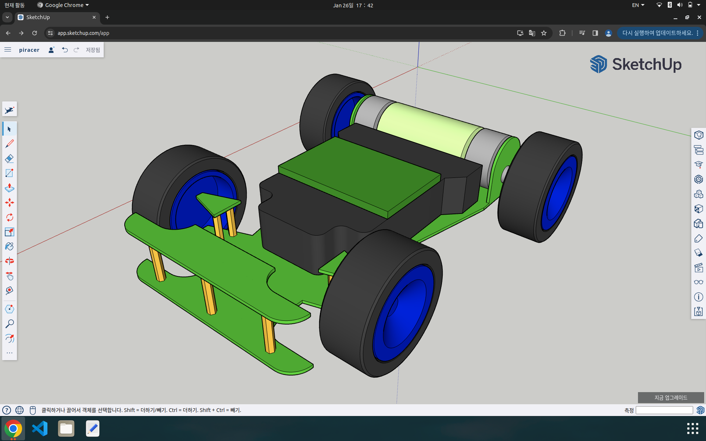

# ADS(Autonomous Driving Systems) Project
## ADS-Perception ( 'Perception' → Planning → Control )
This project will cover the following content.
- LIDAR
- Camera
- GPS (I'm not sure)
- IMU (I'm not sure)  

With ROS2, RViz2, Gazebo, SLAM, Matlab, PyTorch, Yolo ...

## LIDAR code language performance
Laptop_Ubuntu20.04
- py = CPU 1.87%
- cpp = CPU 1.11%

RaspberryPi_Ubuntu20.04
- py = CPU 5.44%
- cpp = CPU 2.51%

maximum rotation speed = 8.3~8.4rps (HW specific)

Manual teleoperation latency  
- pub-sub: 0.03s
- simple SSH: almost 0s

```bash
# enable lidar connection
sudo chmod a+rw /dev/ttyUSB0  

# enable inter-machine connection
sudo ufw disable

# enable controller using ssh connection
ssh <?>@<?> -Y
ssh team5@192.168.1.150
pw = ' '

# run slam toolbox
ros2 launch slam_toolbox online_async_launch.py

realsense-viewer
```

The condition of the piracer hardware such as tire alignment is not in good state so that the vehicle cannot even go perfectly straight. Generally, for the SLAM mapping, it is obvious to provide the odometry of the robot. And to do this, we use 'surface travel distance sensor'. We can somehow implement this kinda thing using existing things like CAN, Arduino and speed sensor. But the problem of hardware will generated too much error and this error will continue to grow as the distance the robot travel increases. And what if some obstacle blocks the way of the piracer while driving and piracer doesn't show the expected movement? Also, speed sensor that I have, measures not vector but scala property so that we need unwanted lines of code about forward and backward movements. Assuming throttle and steering values provided by the driver is constant, we can reproduce this action inside gazebo sim environment. And of course we can extract odometry out of it. Not so sure if 'scan matching' technic can handle accumulating error somehow. Is there a way that I can totally turn off the use of odometry and fully trust the performance of scan matching? For futher works, does this problem can be handled by calibration of the IMU sensor?

-> try with gmapping + laser_scan_matcher OR hector slam




material Gazebo/Grey

material Gazebo/DarkGrey

material Gazebo/White

material Gazebo/FlatBlack

material Gazebo/Black

material Gazebo/Red

material Gazebo/RedBright

material Gazebo/Green

material Gazebo/Blue

material Gazebo/SkyBlue

material Gazebo/Yellow

material Gazebo/ZincYellow

material Gazebo/DarkYellow

material Gazebo/Purple

material Gazebo/Turquoise

material Gazebo/Orange

material Gazebo/Indigo

material Gazebo/WhiteGlow

material Gazebo/RedGlow

material Gazebo/GreenGlow

material Gazebo/BlueGlow

material Gazebo/YellowGlow

material Gazebo/PurpleGlow

material Gazebo/TurquoiseGlow

material Gazebo/TurquoiseGlowOutline

material Gazebo/RedTransparentOverlay

material Gazebo/BlueTransparentOverlay

material Gazebo/GreenTransparentOverlay

material Gazebo/OrangeTransparentOverlay

material Gazebo/DarkOrangeTransparentOverlay

material Gazebo/RedTransparent

material Gazebo/GreenTransparent

material Gazebo/BlueTransparent

material Gazebo/DarkMagentaTransparent

material Gazebo/GreyTransparent

material Gazebo/BlackTransparent

material Gazebo/YellowTransparent

material Gazebo/LightOn

material Gazebo/LightOff

material Gazebo/LightBlueLaser

material Gazebo/BlueLaser

material Gazebo/OrangeTransparent

material Gazebo/JointAnchor

material Gazebo/CoM

material Gazebo/WoodFloor

material Gazebo/CeilingTiled

material Gazebo/PaintedWall

material Gazebo/PioneerBody

material Gazebo/Pioneer2Body

material Gazebo/Gold

material Gazebo/GreyGradientSky

material Gazebo/CloudySky

material Gazebo/WoodPallet

material Gazebo/Wood

material Gazebo/Bricks

material Gazebo/Road

material Gazebo/Residential

material Gazebo/Tertiary

material Gazebo/Pedestrian

material Gazebo/Footway

material Gazebo/Motorway

material Gazebo/Lanes_6

material Gazebo/Trunk

material Gazebo/Lanes_4

material Gazebo/Primary

material Gazebo/Lanes_2

material Gazebo/Secondary

material Gazebo/Lane_1

material Gazebo/Steps

material drc/san_fauxcity_sign

material Gazebo/GaussianCameraNoise

material Gazebo/CameraDistortionMap

material Gazebo/WideLensMap

material Gazebo/CameraLensFlare

material Gazebo/PointCloud

material Gazebo/PointHandle

material Gazebo/BuildingFrame

material Gazebo/Runway

material Gazebo/Grass

material Gazebo/Editor

material Gazebo/EditorPlane

material Gazebo/DepthMap

material Gazebo/XYZPoints

material Gazebo/LaserScan1st

material Gazebo/LaserScan2nd
